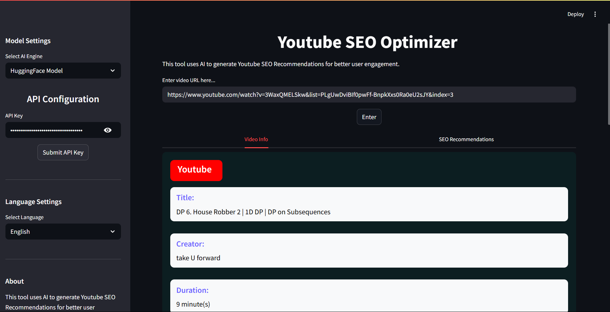

# 🎯 YouTube SEO Recommender

**YouTube SEO Recommender** is an AI-powered application designed to enhance the visibility and reach of YouTube videos. By simply inputting a video URL, users receive optimized titles, descriptions, trending hashtags, and detailed timestamps — all aimed at improving SEO performance.

## 🚀 Features

- **Multiple SEO-Optimized Titles**: Generate compelling and keyword-rich titles to attract more viewers.
- **Enhanced Descriptions**: Craft detailed and engaging video descriptions that improve search rankings.
- **Trending Hashtags**: Receive up to 35 relevant and trending hashtags to increase discoverability.
- **Automatic Timestamps**: Generate precise timestamps to improve viewer navigation and engagement.
- **Dual LLM Integration**: Utilizes Mistral for local processing and Hugging Face models via user-provided API keys for online processing.
- **User-Friendly Interface**: Built with Streamlit for an intuitive and interactive user experience.

## 🧰 Tech Stack

- **Large Language Models (LLMs)**: Mistral (local), Hugging Face (online via user API)
- **Frameworks**: LangChain, Streamlit
- **Programming Language**: Python

## 📸 Screenshots


!(images/home.png)
!(images/seo-recommend.png)
!(images/alternative-titles.png)
!(images/tags.png)

## 🛠️ Installation

1. **Clone the Repository**:
   ```bash
   git clone https://github.com/Sujeet2003/YoutubeSEO.git
   cd YoutubeSEO
   ```

2. **Create a virtual environment (recommended)**:
    ```bash
    python3 -m venv venv
    source venv/bin/activate  # Linux/Mac
    venv\Scripts\activate     # Windows    
    ```

3. **Install dependencies**:
    ```bash
    pip install -r requirements.txt 
    ```

4. **Run the Streamlit app**:
    ```bash
    streamlit run app.py
    ```

## Usage

1. Open your browser and go to the URL provided by Streamlit (usually `http://localhost:8501`).

2. Select the model backend (make changes into `config.py` file for the model credentials):
   - **Hugging Face (Online):**  
     You **must provide your Hugging Face API key** to proceed. The app will validate the API key before generating results.
   - **Local Mistral (or any other) Model:**  
     The app will verify that the local model files and environment are properly set up before processing your request.

3. Paste the **YouTube video URL** you want to optimize.

4. Click on **Enter** to get all video details and then **Generate SEO Recommendations**.

5. View the optimized titles, descriptions, tags, and timestamps displayed on the page.

6. Copy and use the recommendations to enhance your YouTube video metadata.


